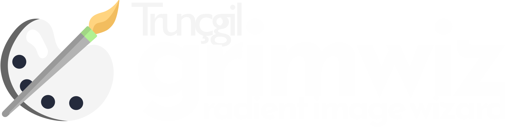

# Grimwiz - Gradient Collage Wizard

<p align="center">
  
</p>

<p align="center">
  A modern web application for creating professional-looking collages with smooth gradient transitions.
</p>

<p align="center">
  <a href="https://grimwiz.truncgil.com">View Demo</a> ·
  <a href="https://github.com/truncgil/gradyan-kolaj/issues">Report Bug</a> ·
  <a href="https://github.com/truncgil/gradyan-kolaj/issues">Request Feature</a>
</p>

## ✨ Features

- **Gradient-based Collages**: Create seamless gradient transitions between multiple images
- **Intuitive Interface**: Simple drag-and-drop operation with real-time editing
- **Built-in Presets**: Ready-to-use templates for Instagram, Facebook, and full HD formats
- **Multilingual Support**: Available in Turkish and English with easy language switching
- **Theme Options**: Light and dark mode with system preference detection
- **Offline Capability**: Progressive Web App (PWA) with offline functionality
- **Responsive Design**: Works on desktop, tablet, and mobile devices
- **Local Storage**: Remembers your canvas size preferences

## 📋 Table of Contents

- [Demo](#-demo)
- [Features](#-features)
- [Installation](#-installation)
- [Usage](#-usage)
- [Technical Documentation](#-technical-documentation)
- [Project Structure](#-project-structure)
- [Used Technologies](#-used-technologies)
- [Contributing](#-contributing)
- [License](#-license)

## 🚀 Demo

Visit [https://grimwiz.truncgil.com](https://grimwiz.truncgil.com) to see Grimwiz in action.

## 💻 Installation

### Prerequisites

- A modern web browser (Chrome, Firefox, Edge, Safari)
- Web server for local development (e.g., Apache, Nginx, or live-server)

### Local Development Setup

1. Clone the repository:

```bash
git clone https://github.com/truncgil/gradyan-kolaj.git
cd grimwiz
```

2. Serve the project using a local server:

```bash
# Using npm and live-server
npm install -g live-server
live-server
```

3. Open your browser and navigate to `http://localhost:8080` (or the URL provided by your web server).

### Production Deployment

1. Build the project (minify CSS, JS files if needed)
2. Upload the files to your web server
3. Ensure HTTPS is enabled for full PWA functionality

## 📖 Usage

### Step 1: Upload Images

1. **Add Images**: Drag and drop your images into the upload area or click "Select File" to browse your device.
2. **Set Canvas Size**: Choose from preset dimensions (Instagram Square, Facebook Share, Full HD) or enter custom dimensions.
3. **Create Collage**: Click "Create Collage" to proceed to the editing stage.

### Step 2: Edit Collage

1. **Manipulate Images**: Use the tools to move, rotate, or resize images.
2. **Preview**: See the real-time preview of your gradient collage.
3. **Download**: Export your creation as a JPG or PNG file.

### Additional Controls

- **Zoom Controls**: Use the zoom buttons (+ and -) or mouse wheel to zoom in and out
- **Theme Toggle**: Switch between light and dark themes
- **Language Selection**: Change the interface language (English/Turkish)

## 📚 Technical Documentation

### Konva.js Implementation

Grimwiz uses [Konva.js](https://konvajs.org/) for canvas manipulation. The core functionality is implemented in `script.js`:

```javascript
// Core function for creating gradient collages
function createCollage() {
    // Initialize stage and layer
    // For each image:
    //   1. Calculate aspect ratio and position
    //   2. Apply gradient masks at edges
    //   3. Add to layer with proper z-index
    //   4. Make draggable and add to transformer
}
```

Key Konva.js components used:
- `Konva.Stage`: Main container for all canvas elements
- `Konva.Layer`: Container for visual elements
- `Konva.Image`: For displaying and manipulating images
- `Konva.Group`: For grouping related elements
- `Konva.Transformer`: For transforming (moving, rotating, resizing) elements

### Gradient Transition Algorithm

The gradient effect between images is created using HTML5 Canvas API:

```javascript
// For each image:
const canvas = document.createElement('canvas');
canvas.width = imgWidth;
canvas.height = imgHeight;
const ctx = canvas.getContext('2d');

// Draw the image
ctx.drawImage(image.element, 0, 0, imgWidth, imgHeight);

// Create gradient mask
const gradient = ctx.createLinearGradient(0, 0, imgWidth, 0);
gradient.addColorStop(0, 'rgba(0,0,0,1)'); // Fully opaque (left edge)
gradient.addColorStop(0.3, 'rgba(0,0,0,0)'); // Transparent
gradient.addColorStop(0.7, 'rgba(0,0,0,0)'); // Transparent
gradient.addColorStop(1, 'rgba(0,0,0,1)'); // Fully opaque (right edge)

// Apply gradient mask
ctx.globalCompositeOperation = 'destination-out';
ctx.fillStyle = gradient;
ctx.fillRect(0, 0, imgWidth, imgHeight);
```

### Translation System

The application uses a simple i18n system with language definitions in `translations.js`:

```javascript
// Translation usage
function i18n(key) {
    // Get translation for current language
    if (translations[currentLanguage] && translations[currentLanguage][key]) {
        return translations[currentLanguage][key];
    }
    
    // Fallback to default language
    if (translations.tr && translations.tr[key]) {
        return translations.tr[key];
    }
    
    // Return key if no translation found
    return key;
}

// Apply translations to the page
function translatePage() {
    // Find all elements with data-i18n attribute
    const elements = document.querySelectorAll('[data-i18n]');
    
    elements.forEach(element => {
        const key = element.getAttribute('data-i18n');
        if (key) {
            element.textContent = i18n(key);
        }
    });
    
    // Update document title and tooltips
    document.title = i18n('appTitle');
    updateTooltips();
}
```

### PWA Implementation

The Progressive Web App functionality is implemented with:

1. **Manifest File** (`manifest.json`): Defines app metadata, icons, and display properties
2. **Service Worker** (`service-worker.js`): Handles caching and offline functionality
3. **Offline Page** (`offline.html`): Custom page displayed when no internet connection is available

## 🗂️ Project Structure

```
grimwiz/
├── index.html              # Main HTML file
├── offline.html            # Offline fallback page
├── manifest.json           # PWA manifest
├── favicon.ico             # Favicon
├── service-worker.js       # Service worker for offline functionality
├── script.js               # Main JavaScript file
├── styles.css              # Main CSS file
├── translations.js         # Language translations
├── icons/                  # App icons
│   ├── android-chrome-192x192.png
│   ├── android-chrome-512x512.png
│   ├── logo2.svg
│   └── ...
└── README.md               # This documentation
```

## 🛠️ Used Technologies

- **Frontend Framework**: Vanilla JavaScript with Material Design Lite
- **Canvas Manipulation**: Konva.js 9.2.3
- **Styling**: Custom CSS with Material Design principles
- **Progressive Web App**: Service Workers, Web App Manifest
- **Internationalization**: Custom i18n implementation
- **Local Storage**: For saving user preferences
- **Responsive Design**: Media queries and flexible layouts

## 🤝 Contributing

Contributions are welcome! Here's how you can contribute:

1. Fork the repository
2. Create a feature branch (`git checkout -b feature/amazing-feature`)
3. Commit your changes (`git commit -m 'Add some amazing feature'`)
4. Push to the branch (`git push origin feature/amazing-feature`)
5. Open a Pull Request

## 📄 License

This project is licensed under the MIT License - see the LICENSE file for details.

## 🙏 Acknowledgements

- [Konva.js](https://konvajs.org/) for canvas manipulation
- [Material Design Lite](https://getmdl.io/) for UI components
- [Google Fonts](https://fonts.google.com/) for typography

---

<p align="center">
  Developed with ❤️ by <a href="https://truncgil.com/">Truncgil</a>
</p> 